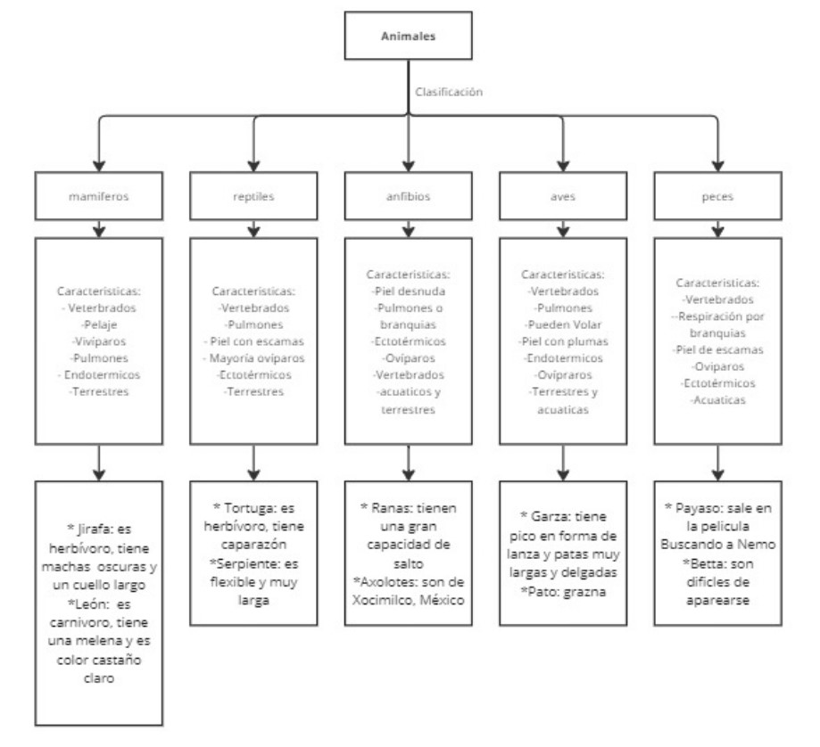
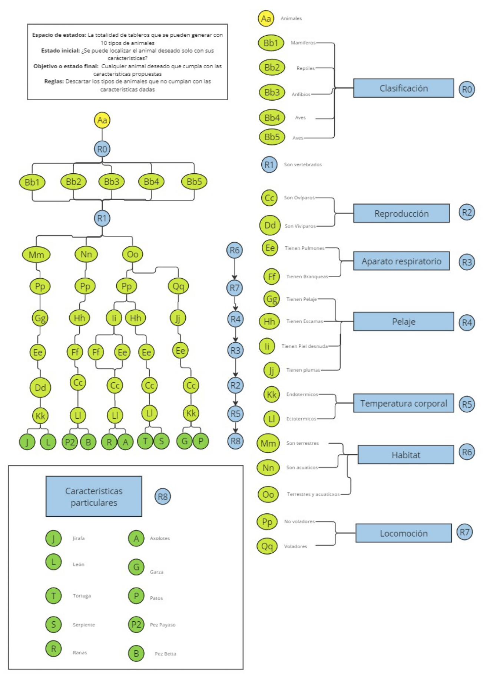
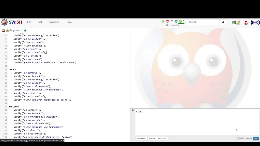

## Objetivos


Para la implementación del programa deseado, en primer lugar nos tendremos que plantear la estructura que va a tener nuestra lista de animales. Esta estructura será un árbol, en el que en las hojas se encontrarán los distintos animales, y llegaremos a ellos por medio de las distintas características diferenciadoras que tiene cada uno. Una de las principales características será su clasificación en: reptiles, anfibios, mamíferos, aves y peces.
Para realizar esta clasificación debemos tener en cuenta que las preguntas a realizar nos tienen que caracterizar una de las hojas frente a otra, y así poder llegar a la hoja deseada sin ningún tipo de ambigüedad. La lista mínima de animales a tener en cuenta para el desarrollo de esta práctica debe considerar dos animales por cada categoría principal.
Para cumplir con la segunda fase del trabajo final debes realizar:


1. El árbol que vamos a emplear, dibujarlo e incluirlo en el reporte a entregar.
   * Diseño de un mapa donde obtendremos las caracteristicas y un bosquejo de la ordenación del arbol con sus ramas


    
   * Diseño del arból con sus respectivas ramas 


    


2. Código con las preguntas sobre las características que debe cumplir, comenzando por el animal situado más a la izquierda del árbol y por la pregunta del nodo raíz. Se seguirán verificando las características para un mismo animal siempre que se responda afirmativamente a las preguntas y se pasará a comprobar las características del animal siguiente (el situado inmediatamente a la derecha del animal actual) cada vez que se responda negativamente a una de las preguntas. De esta forma, cuando lleguemos a una hoja del árbol el programa dará como solución un animal que cumpla todas las preguntas anteriormente realizadas.


   * Aplicación y prueba del código 


    

3. Documentación en el reporte de cada una de las funciones que implementes en el programa.


    * Explicación del bloque de código 

_Se define una regla llamada start, que es el punto de entrada del programa. Se le pide al usuario que escriba "start" para comenzar el juego. Si el usuario escribe "start", se llama a la regla main, de lo contrario, se muestra un mensaje indicando que el comando no es reconocido y se vuelve a pedir al usuario que escriba "start"._
```
    start :-
    write('Escribe "start" para comenzar la adivinanza: '),
    read(Input),
    (Input == start ->
        main;
        write('Comando no reconocido. Escribe "start" para comenzar.'), nl).
```
_Se define una regla main, que es donde ocurre la lógica principal del juego. En esta regla, se llama a `hypothesis(Animal)`, que intentará adivinar el animal. Luego, se muestra el animal adivinado al usuario, seguido de la llamada a undo, que permite al usuario jugar nuevamente o terminar el juego._
```
main :-
    hypothesis(Animal),
    write('El animal es: '),
    write(Animal),
    nl,
    undo.
```
_Esta regla define las posibles hipótesis (animales) que el programa intentará adivinar. Cada hipótesis tiene un conjunto de características asociadas que se verificarán._
```
/* Hipótesis que van a ser puestas a prueba */
hypothesis(leon):- leon, !.
hypothesis(jirafa):- jirafa, !.
hypothesis(tortuga):- tortuga,!.
hypothesis(serpiente):- serpiente,!.
hypothesis(rana):- rana, !.
hypothesis(axolote):- axolote, !.
hypothesis(garza):- garza, !.
hypothesis(pato):- pato,!.
hypothesis(pezpayaso):- pezpayaso, !.
hypothesis(pezbetta):- pezbetta, !.
hypothesis("Animal desconocido").

/* Identificación de cada hipótesis */
leon:-
    verify("es mamífero"),
    verify("es vertebrado"),
    verify("es terrestre"),
    verify("es no volador"),
    verify("tiene pelaje"),
    verify("tiene pulmones"),
    verify("es vivíparo"),
    verify("es endotermico"),
    verify("es carnivoro"),
    verify("es castaño claro"),
    verify("tiene una melena").

jirafa:-
    verify("es mamífero"),
    verify("es vertebrado"),
    verify("es terrestre"),
    verify("es no volador"),
    verify("tiene pelaje"),
    verify("tiene pulmones"),
    verify("es vivíparo"),
    verify("es endotermico"),
    verify("es mamífero"),
    verify("es herbívoro"),
    verify("viven en manadas"),
    verify("tiene manchas oscuras"),
    verify("tiene cuello largo").

tortuga:-
    verify("es reptil"),
    verify("es vertebrado"),
    verify("es terrestre y/o acuatico"),
    verify("es no volador"),
    verify("tiene escamas"),
    verify("tiene pulmones"),
    verify("es ovíparo"),
    verify("es ectotermico"),
    verify("es herbívoro"),
    verify("tiene un caparazón").

serpiente:-
    verify("es reptil"),
    verify("es vertebrado"),
    verify("es terrestre y/o acuatico"),
    verify("es no volador"),
    verify("tiene escamas"),
    verify("tiene pulmones"),
    verify("es ovíparo"),
    verify("es ectotermico"),
    verify("es flexible"),
    verify("es carnivoro"),
    verify("puede llegar a medir hasta 2m de largo").
    
rana:-
    verify("es anfibio"),
    verify("es vertebrado"),
    verify("es terrestre y/o acuatico"),
    verify("es no volador"),
    verify("tiene piel desnuda"),
    verify("tiene pulmones y/o branquias"),
    verify("es ovíparo"),
    verify("es ectotermico"),
    verify("tiene una gran capacidad de salto").
axolote:-
    verify("es anfibio"),
    verify("es vertebrado"),
    verify("es terrestre y/o acuatico"),
    verify("es no volador"),
    verify("tiene piel desnuda"),
    verify("tiene pulmones y/o branquias"),
    verify("es ovíparo"),
    verify("es ectotermico"),
    verify("es originario de Xochimilco, México").
    
pato:-
    verify("es un ave"),
    verify("es vertebrado"),
    verify("es terrestre y/o acuatico"),
    verify("es volador"),
    verify("tiene plumas"),
    verify("tiene pulmones"),
    verify("es ovíparo"),
    verify("es endotermico"),
    verify("grazna").

garza:-
    verify("es un ave"),
    verify("es vertebrado"),
    verify("es terrestre y/o acuatico"),
    verify("es volador"),
    verify("tiene plumas"),
    verify("tiene pulmones"),
    verify("es ovíparo"),
    verify("es endotermico"),
    verify("tiene pico en forma de lanza y patasmuy largas y delgadas").

pezpayaso:-
    verify("es un pez"),
    verify("es vertebrado"),
    verify("es acuatico"),
    verify("es no volador"),
    verify("tiene escamas"),
    verify("tiene branquias"),
    verify("es ovíparo"),
    verify("es ectotérmico"),
    verify("sale en la película <buscando a Nemo>").

pezbetta:-
    verify("es un pez"),
    verify("es vertebrado"),
    verify("es acuatico"),
    verify("es no volador"),
    verify("tiene escamas"),
    verify("tiene branquias"),
    verify("es ovíparo"),
    verify("es ectotérmico"),
    verify("son dificiles de aparearse").

```
_Esta regla se utiliza para preguntar al usuario si una cierta característica Question es verdadera o falsa. El usuario responde con "yes" o "no" y su respuesta se almacena en la base de conocimientos._
```
   /* Crear una pregunta */
ask(Question) :-
    write('El animal '),
    write(Question),
    write('? '),
    read(Response),
    nl,
    ( (Response == yes ; Response == y ; Response == si) ->
       assert(yes(Question)) ;
       assert(no(Question)), fail).

:- dynamic yes/1, no/1.
```
_Esta regla se utiliza para verificar si una característica S es verdadera (yes) o falsa (no). Si la característica ya ha sido afirmada o negada por el usuario, retorna true o false respectivamente. Si no se ha verificado todavía, el programa pregunta al usuario si la característica es verdadera o falsa y la almacena en la base de conocimientos._
```
/* Verificación */
verify(S) :- (yes(S) -> true ;
               (no(S)  -> fail ;
               ask(S))).
``` 
_Esta regla se utiliza para eliminar las cláusulas creadas dinámicamente (características afirmadas o negadas) cuando se reinicia el juego o se termina. Es un mecanismo de limpieza para preparar el programa para una nueva sesión de juego._
```  
/* Eliminar las cláusulas creadas */
undo :- retract(yes(_)),fail.
undo :- retract(no(_)),fail.
undo.
```

